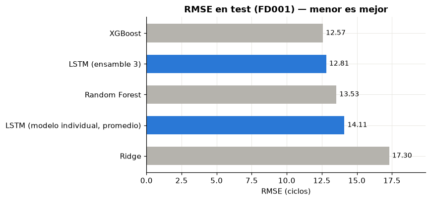
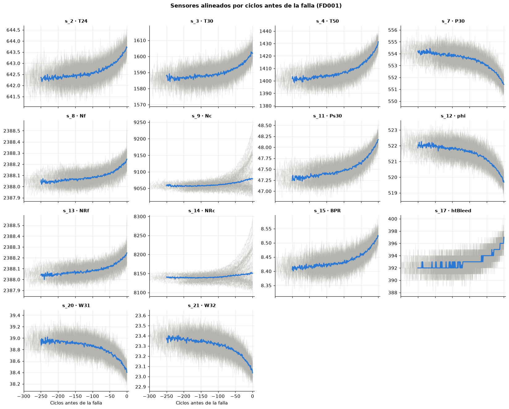

[🇬🇧 English](README.md) | 🇪🇸 Español

# Mantenimiento predictivo: vida útil remanente de motores turbofan con LSTM

## Descripción del proyecto

Este proyecto predice la **vida útil remanente (RUL, *Remaining Useful Life*)** de motores turbofan de avión a partir de series de tiempo multivariadas de sensores, usando una red neuronal **LSTM (*Long Short-Term Memory*)** construida con TensorFlow/Keras. El objetivo es apoyar el **mantenimiento basado en condición**: programar intervenciones según el estado real de cada motor, en vez de calendarios fijos o después de la falla.

La LSTM se compara contra modelos clásicos de machine learning (Random Forest, XGBoost) entrenados con la misma información, de modo que la elección de un modelo de deep learning se justifica con resultados y no se da por supuesta.

---

## Objetivo

- Modelar la degradación de motores a partir de 21 sensores registrados ciclo a ciclo hasta la falla.
- Predecir cuántos ciclos de operación le quedan a cada motor antes de fallar.
- Comparar un modelo secuencial (LSTM) con baselines tabulares usando RMSE, MAE y la función de puntaje asimétrica de la NASA, que castiga más las predicciones tardías que las tempranas.

---

## Dataset

**NASA C-MAPSS Turbofan Engine Degradation Simulation** (Saxena & Goebel, 2008), el benchmark estándar de pronóstico de fallas y mantenimiento predictivo. Cada motor parte sano, con un desgaste inicial desconocido, y desarrolla una falla hasta dejar de operar.

| Subconjunto | Motores train / test | Condiciones de operación | Modos de falla |
|---|---|---|---|
| **FD001** (este proyecto) | 100 / 100 | 1 | 1 (degradación del HPC) |

Los datos no se versionan en git — ver [`data/README.md`](data/README.md) para las instrucciones de descarga.

---

## Metodología

1. **Análisis exploratorio** — calidad de datos, vida útil de los motores, sensores sin información, tendencias de degradación alineadas por ciclos antes de la falla, correlación con la RUL.
2. **Definición del objetivo** — RUL lineal por tramos con tope de 125 ciclos (la vida temprana sana no es observable en los sensores).
3. **Preparación sin fuga de datos** — separación train/validación **por motor**, escalado Min-Max ajustado solo con train, ventanas deslizantes de 30 ciclos.
4. **Baselines** — Random Forest y XGBoost con features de ventana (último valor, media móvil, desviación móvil, pendiente).
5. **LSTM** — LSTM apilada (64 → 32 unidades) con dropout, reescalado de la salida, early stopping y ajuste de tasa de aprendizaje; modelo final como ensamble de 3 semillas.
6. **Evaluación** — RMSE, MAE y NASA score sobre el conjunto de prueba oficial.

---

## Resultados

Evaluación sobre el conjunto de prueba oficial de FD001 (100 motores, último ciclo observado, RUL con tope de 125):

| Modelo | RMSE | MAE | NASA score |
|---|---:|---:|---:|
| **XGBoost** (features de ventana) | **12,57** | **9,66** | **237,2** |
| **LSTM** (ensamble de 3 modelos) | 12,81 | 9,93 | 256,5 |
| Random Forest (features de ventana) | 13,53 | 10,47 | 296,1 |
| LSTM (modelo individual, media de 3 semillas) | 14,11 ± 0,68 | 10,59 | 326,9 |
| Ridge | 17,30 | 13,95 | 572,5 |
| Promedio (referencia) | 41,94 | 34,83 | 33.354,5 |



### Hallazgos principales

- **Desempeño equivalente:** el ensamble LSTM (RMSE 12,81) y XGBoost (12,57) difieren en 0,24 ciclos (1,9%). La LSTM alcanza este nivel a partir de la secuencia cruda de sensores, sin ingeniería de features; XGBoost requiere 56 features de ventana diseñadas manualmente.
- **Importancia del ensamble:** los modelos LSTM individuales varían según la semilla (RMSE 14,11 ± 0,68). Promediar tres modelos reduce el error en un 9% y elimina esa dependencia.
- **Precisión en el tramo crítico:** el error de la LSTM es menor en motores próximos a la falla (MAE de 4,3 ciclos con RUL ≤ 25 y de 5,9 ciclos con RUL entre 26 y 50), el rango en que se toman las decisiones de mantenimiento.
- **Selección de modelo:** para FD001, XGBoost ofrece el menor error, menor costo de entrenamiento y mayor interpretabilidad. La LSTM es una alternativa competitiva que no depende del diseño manual de features, característica relevante en escenarios con múltiples condiciones de operación (FD002/FD004).



---

## Estructura del proyecto

```
predictive-maintenance-turbofan/
├── data/
│   ├── raw/                       # archivos .txt de C-MAPSS (no versionados)
│   └── README.md                  # instrucciones de descarga
├── notebooks/
│   ├── 01_exploracion_datos.ipynb # análisis exploratorio
│   ├── 02_baselines.ipynb         # Ridge, Random Forest, XGBoost
│   └── 03_lstm.ipynb              # LSTM y comparación final
├── src/
│   ├── data_processing.py         # carga, RUL, escalado, secuencias, features de ventana
│   └── models.py                  # métricas (RMSE, MAE, NASA score) y LSTM
├── models/                        # modelos entrenados (no versionados)
├── reports/
│   ├── figures/                   # gráficos exportados
│   └── resultados_finales.csv     # métricas finales
├── requirements.txt
└── README.md / README.es.md
```

---

## Cómo ejecutarlo

```bash
git clone https://github.com/DamarizVera/predictive-maintenance-turbofan.git
cd predictive-maintenance-turbofan
python3.12 -m venv .venv   # TensorFlow soporta Python 3.10–3.13
source .venv/bin/activate
pip install -r requirements.txt
# descargar los datos en data/raw/ (ver data/README.md)
jupyter notebook notebooks/
```

---

## Tecnologías

Python · pandas · NumPy · scikit-learn · XGBoost · TensorFlow/Keras · Matplotlib · Seaborn

---

## Referencia

A. Saxena, K. Goebel, D. Simon y N. Eklund, "Damage Propagation Modeling for Aircraft Engine Run-to-Failure Simulation", *International Conference on Prognostics and Health Management (PHM08)*, Denver, CO, 2008.

---

## Autora

**Damariz Vera** — Data Science & Business Intelligence
[github.com/DamarizVera](https://github.com/DamarizVera)
